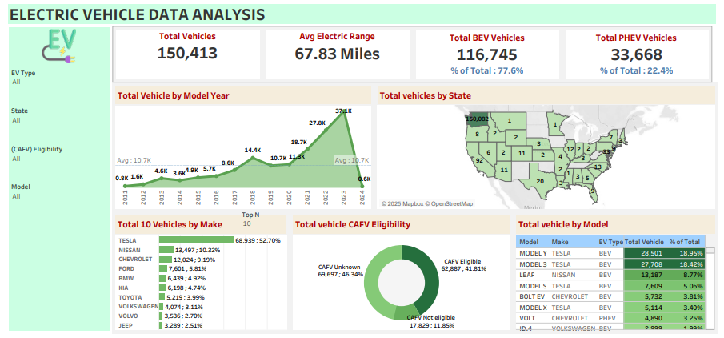

# Electric Vehicle Data Analysis Dashboard (Tableau)

 
## Description  
A Tableau dashboard analyzing electric vehicle (EV) data, including total vehicles, battery electric vehicle (BEV) vs. plug-in hybrid electric vehicle (PHEV) distribution, CAFV eligibility, and state-wise adoption trends.

## Key Metrics  
- **Total Vehicles**: 150,413  
- **Avg Electric Range**: 67.83 miles  
- **Top EV Types**:  
  - BEV: 77.6% (116,745 vehicles)  
  - PHEV: 22.4% (33,668 vehicles)  
- **Top States by EV Adoption**:  
  - California (CA): Dominant share (inferred from data)  
- **CAFV Eligibility**:  
  - Eligible: 41.81% (62,887 vehicles)  
  - Not Eligible: 11.85% (17,829 vehicles)  

## Data Highlights  
- **Vehicle Distribution by Year**:  
  - 2021: 37.1K vehicles  
  - 2020: 27.8K vehicles  
  - 2019: 18.7K vehicles  
- **Top Makes**:  
  - Tesla: 52.7% (68,939 vehicles)  
  - Nissan: 9.1% (13,497 vehicles)  
  - Chevrolet: 5.81% (8,743 vehicles)  
- **Top Models**:  
  - Tesla Model Y: 18.95% (28,501 vehicles)  
  - Tesla Model 3: 18.42% (27,708 vehicles)  
- **Eligibility Breakdown**:  
  - CAFV Eligible: 41.81%  
  - CAFV Not Eligible: 11.85%  
  - CAFV Unknown: 46.34%  

## Tools & Technologies  
- **Tableau Desktop** (Data Blending, Calculated Fields, Dashboards)  
- **Data Visualization**: Bar charts, maps, pie charts, trend lines  
- **Data Sources**: EV registration datasets, CAFV eligibility reports  

## How to Use  
1. Open the `.twb` file in **Tableau Desktop** or **Tableau Public**.  
2. Use filters to explore vehicle distribution by year, state, or eligibility.  
3. Hover over visuals for detailed breakdowns (e.g., state-wise adoption rates).  
